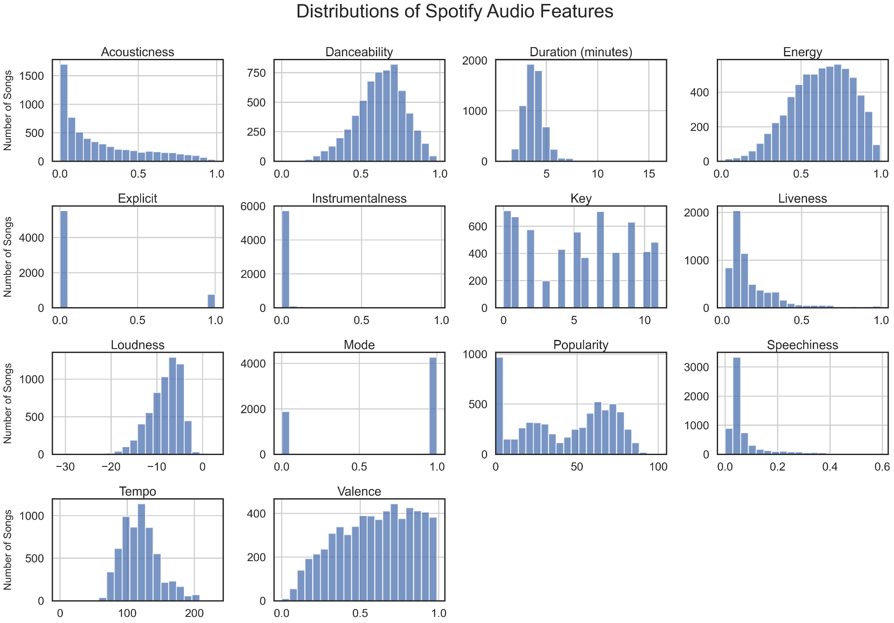
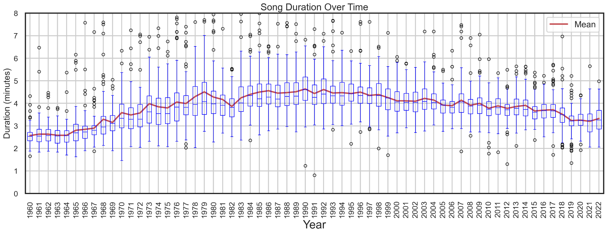
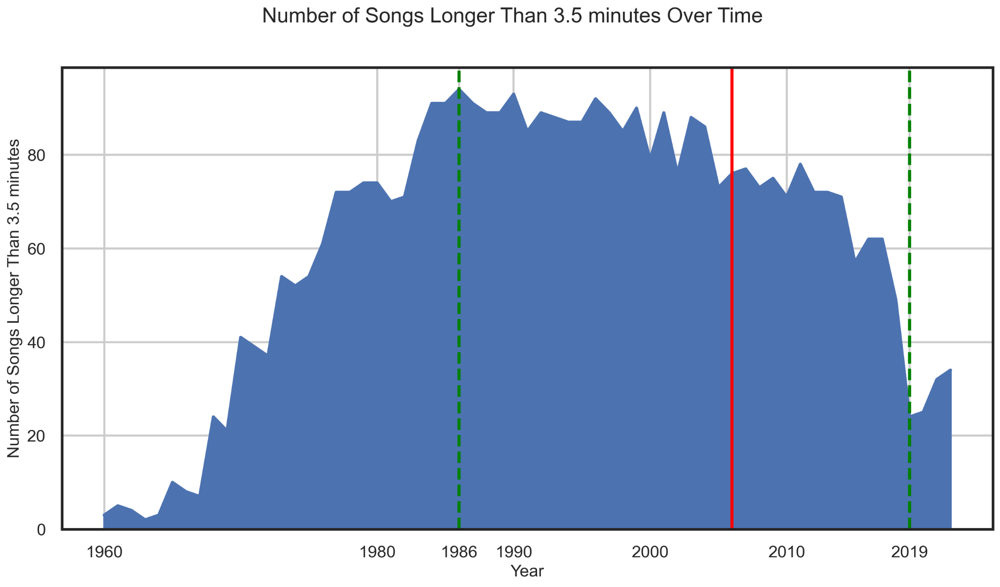
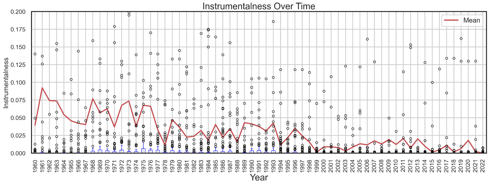
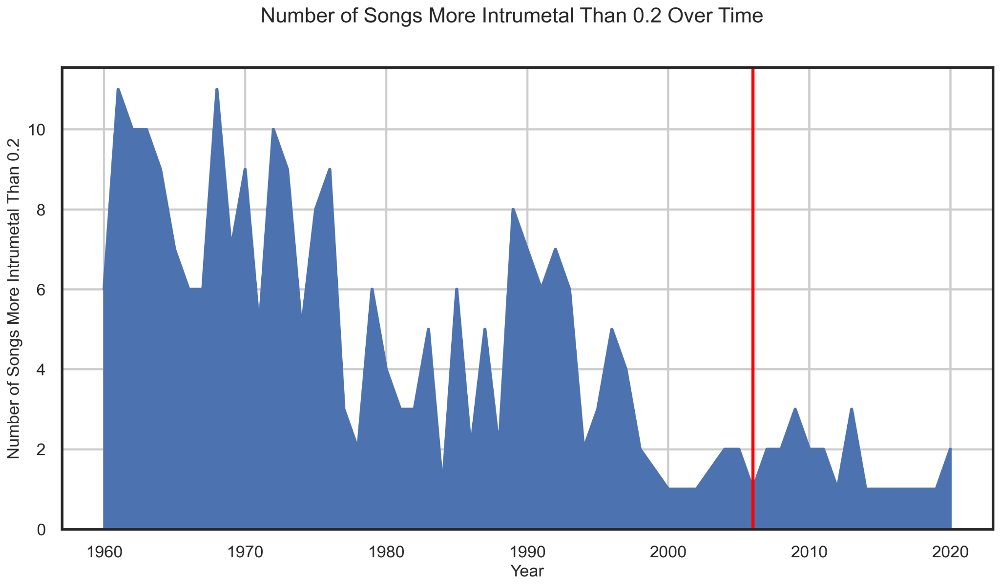

# XU HƯỚNG PHÁT TRIỂN CỦA ÂM NHẠC ĐẠI CHÚNG

## 0. Giới thiệu 
### Động lực
Âm nhạc mang đến một góc nhìn độc đáo để nghiên cứu những bận tâm của xã hội. Mọi người đánh giá cao điều gì trong hoạt động giả trí và sở thích văn hóa thay đổi thế nào qua từng thế hệ. Tạp chí Billboard đăng tải một bảng xếp hạng hàng năm, Year-End Hot 100 xếp hạng những bài hát thành công nhất của Hoa Kỳ dựa trên dữ liệu thu thập từ doanh số bán hàng thực tế, bán hàng kỹ thuật số, phát sóng trên radio và phát trực tiếp. Để có thể phân tích được xu hướng của âm nhạc qua các năm, nhóm đã thu thập dữ liệu của 100 bài hát nổi mỗi năm, cùng với lời bài hát và các đặc điểm. Sự kết hợp dữ liệu như vậy cung cấp nhiều cách trực quan hóa và phân tích phong phú và thú vị.

### Tập dữ liệu
Để có thể thu được tên các bài hát và xếp hạng của chúng từ bảng xếp hạng Billboard’s Year-End Hot 100, dữ liệu được lấy từ [bảng Wikipedia](https://en.wikipedia.org/wiki/Billboard_Year-End_Hot_100_singles_of_2022) tương ứng từ năm 1960-2022. Về phần lời cho mỗi bài hát, có nhiều dịch vụ cung cấp API để có thể lấy được lời bài hát, nhưng chúng không miễn phí, số lượng bài hát lấy được lời bị giới hạn hoặc chỉ một phần của lời bài hát được trả về. May mắn là [genius.com](genius.com) và [songlyrics.com](songlyrics.com) cung cấp lời trên trang web mà đường dẫn URL có quy ước nhất quán. Điều này có nghĩa là dữ liệu về lời có thể được thu thập từ đây. Cuối cùng, dữ liệu đặc điểm âm thanh của Spotify được lấy trực tiếp sử dụng Spotify’s API qua các bài hát thu thập được được từ Wikipedia. Sau quá trình thu thập, Tập dữ liệu gồm 6301 mẫu, trong đó có 6250 bài có lời và 6153 bài có đặc tính âm thanh từ Spotify.

Các đặc điểm âm thanh thu thập từ Spotify bao gồm nhiều chỉ số, trong đó một số liên quan đến nội dung của lời bài hát, một số đo các thuộc tính khách quan của bài hát, và một số đo các thuộc tính chủ quan như tính tích cực của một bài hát. Dưới đây là phân phối của mỗi đặc trưng giải thích ngắn gọn về ý nghĩa của chúng.

**Acousticness**: Mô tả xem bài hát sử dụng chủ yếu nhạc cụ cổ điển (như guitar, piano cơ...) hay nhạc cụ điện tử (guitar điện, phần mềm…). Giá trị 1.0 cho thấy một bài hát hoàn toàn gồm nhạc cụ cổ điển, và từ biểu đồ phân phối có thể thấy nhạc cụ điện tử được sử dụng nhiều hơn nhạc cụ truyền thống cho các bài hát Top 100.

**Danceability**: Mô tả mức độ phù hợp để nhảy theo của một bài hát dựa trên sự kết hợp các yếu tố âm nhạc, với giá trị 1.0 rất dễ nhảy theo. Độ phù hợp để nhảy theo của các bài hát phân phối gần giống phân phối chuẩn quanh giá trị 0.7.

**Duration (phút)**: Thời lượng của bài hát. Hầu hết các bài hát có thời lượng từ 3-5 phút.

**Energy**: đây là một đo lường cảm nhận về cường độ của một bài hát. Các bài hát mang năng lượng cao có tốc độ nhanh và âm lượng lớn. Ví dụ, nhạc heavy metal sẽ có giá trị năng lượng cao trong khi một bản nhạc dạo của Bach sẽ có giá trị thấp. Hầu hết các bài hát có mức năng lượng khá cao.

**Explicit**: cho biết một bài hát có chứa lời không phù hợp, e.g. chửi thề hay không. Đa số các bài hát không chứa từ ngữ thô tục.

**Instrumentalness**: Giá trị càng gần với 1 thì càng có nhiều khả năng bài hát không chứa nội dung giọng hát, hay còn gọi là nhạc không lời. Dễ hiểu rằng hầu hết các bài hát ở Top 100 đều có lời.

**Key**: Đại diện cho tông của bài hát. Số nguyên tương ứng với các nốt âm bằng cách sử dụng [ký hiệu lớp nốt chuẩn](https://en.wikipedia.org/wiki/Pitch_class), trong đó 0 = C, 1 = C#/Db, 2 = D, v.v.

**Liveness**: Phát hiện sự có mặt của khán giả trong bài hát. Giá trị cao thể hiện khả năng ca khúc được trình diễn và ghi âm trực tiếp. Phần lớn các bài hát được thu âm trong studio. 

**Loudness**: Đo âm lượng của một bản ghi âm, được đo bằng đơn vị decibel (dB).  m lượng được tính trung bình trên toàn bộ bài hát và thường nằm trong khoảng từ -60dB đến 0dB. Hầu hết các bài hát có âm lượng lớn hơn -10dB.

**Mode**: Chỉ ra liệu một bài hát chủ yếu là trong tông trưởng (major) hay tông thứ (minor). Hơn 2/3 số bài hát là tông trưởng.

**Popularity**: Là một chỉ số cho biết độ phổ biến mà một bài hát, dựa trên tần suất mà bài hát đã được nghe trên Spotify, trong đó các lần phát gần đây có trọng số cao hơn.

**Speechiness**: Phát hiện sự hiện diện của văn nói trong bài hát. Giá trị 1.0 thể hiện bài hát có sự hiện diện chủ yếu là từ nói (ví dụ: podcast, sách nói, v.v.).

**Tempo**: Đây là tốc độ của một bài hát, được đo bằng số nhịp mỗi phút (BPM). Nhịp độ có vẻ phân phối xung quanh 120BPM.

**Valence**: Miêu tả sự tích cực được truyền đạt bằng âm nhạc trong một bài hát. Nói cách khác, các bài hát có valence cao thì âm thanh vui vẻ/tích cực, trong khi bài hát có valence thấp tương đương âm thanh tiêu cực/ủ rũ/căng thẳng. Dữ liệu cho thấy các bài hát có xu hướng vui vẻ, tích cực.

## 1. Phân tích đặc điểm bài hát
### Công nghệ tốt hơn và khả năng tập trung kém hơn

Từ năm 1960 đến 1990, thời lượng trung bình của các bài hát tăng đều từ khoảng ~2,5 phút lên ~4,5 phút, có thể do việc phát minh băng cassette vào đầu những năm 1960 và đĩa CD vào đầu những năm 1980. Cả hai phương tiện này đều có thể lưu trữ nhiều âm nhạc hơn so với đĩa than, cho phép các bài hát trở nên dài hơn rất nhiều. Từ năm 1990 trở đi, các bài hát dần ngắn lại khoảng ~3,6 phút, có thể do sự cạnh tranh trong việc phát sóng trên radio và khả năng tập trung kém hơn. Kể từ năm 2010, sự xuất hiện của các nền tảng phát trực tuyến cung cấp cho người nghe lựa chọn âm nhạc rộng lớn hơn bao giờ hết, khiến các nghệ sĩ làm ngắn và gọn các bài hát để tránh bị bỏ qua và phù hợp hơn với thị hiếu người nghe.

Năm 2019, chỉ có 24 bài trong Top 100 dài hơn 3,5 phút. Con số này năm 1986 là 94.

### Cắt bỏ bớt phần nhạc thừa

Với thời lượng ngày càng ngắn, các nghệ sĩ muốn đóng gói nhiều nội dung nhất có thể. Điều này khiến cho instrumentalness của các bài hát ngày càng giảm.

Số lượng bài hát trong Top 100 có instrumentalness cao hơn 0.2 qua các năm chỉ khoảng 10%, năm vừa rồi chỉ còn 2%.

Có hai yếu tố có thể đang thúc đẩy xu hướng chung này:
    
1. Nhạc không lời  (ví dụ: nhạc cổ điển) dần trở nên ít phổ biến hơn
2. Sự ‘ngắn hóa’ bài hát do khả năng tập trung kém hơn đã làm cho các phần nhạc cụ của bài hát, như phần dạo nhạc, solo và phần kết thúc, là những phần đầu tiên bị cắt.

### Cuộc chạy đua âm lượng

Trong 1 thế kỷ qua, âm lượng trung bình của các bài hát đã tăng từ -10dB lên -5dB. Hiện tượng này được gọi là “Cuộc chạy đua âm lượng” (Loudness War). Người nghe có thói quen ưa thích nhạc to hơn so với nhạc nhẹ nhàng, và khi thị trường âm nhạc trở nên ngày càng chật chội, đông đúc, các nhạc sĩ phải đẩy âm lượng trung bình của bài hát được tăng lên để nổi bật hơn, và một "cuộc chiến âm lượng" là không thể tránh khỏi.

Nếu như năm 1960, chỉ có khoảng 20 bài to hơn -7.5dB thì đến hiện tại chỉ có 20 bài nhỏ hơn -7.5dB.

### Nhạc ngày càng dễ nhảy theo

Với sự phát triển của các nền tảng như Youtube, Tiktok, Instagram,.. ngày càng có nhiều video nhảy theo nhạc. Các nghệ sĩ muốn dùng phương thức này để quảng bá bài hát của họ hơn nữa. Chính vì thế các bài hát đang có xu hướng phù hợp để nhảy theo hơn.

### Tương quan giữa các đặc điểm theo thời gian

Bảng tương quan cho thấy mối quan hệ giữa các đặc điểm âm thanh trên Spotify. Các mối quan hệ được tính trong khoảng từ -1 tới 1, với 1 tương ứng tương quan rất cao, 0 là không có sự tương quan và -1 là 2 đặc điểm có tương quan nghịch. Trong khi hầu hết các cặp đặc điểm có hệ số tương quan (R) gần 0, một số ít cặp đặc điểm có mối quan hệ tương quan với nhau:

- Energy vs. Loudness có tương quan cao với R = 0.7
- Explicit vs. Speechiness có tương quan khá cao với R = 0.5
- Acousticness vs. Loudness có tương quan nghịch khá cao với R = -0.4
- Acousticness vs. Energy có tương quan nghịch cao với R = -0.6
### Ngày càng nhiều năng lượng

Như đã đề cập ở trên, “Cuộc chạy đua âm lượng” đã góp phần đẩy năng lượng của bài hát lên, một phần nhằm kích thích sự hưng phấn, năng lượng của người nghe. Có thể thấy rõ rằng khi bài hát càng to thì năng lượng của nó lại càng nhiều, đặc biệt là các bài hát phát hành những năm gần đây.

Mối quan hệ nghịch đảo giữa đặc tính acousticness và energy trở nên thú vị hơn khi chúng ta xem xét sự phát triển của nó qua các năm. Các biểu đồ phân tán nhỏ hiển thị acousticness và energy của từng các bài hát theo thập kỷ, trong khi biểu đồ phân tán lớn hiển thị acousticness và energy của tất cả các bài hát với năm phát hành được biểu thị bằng màu sắc.

Xu hướng giảm acousticness và tăng energy theo thời gian được thể hiện rõ ràng. Phân bố của acousticness và energy trở nên đồng đều hơn trong thập kỷ 1960, tạo thành một cụm nhỏ xung quanh giá trị 0.8 acousticness và 0.33 energy. Tuy nhiên, ngay từ những năm 1970, vùng phân bố dày đặc nhất là gần giá trị 0.0 acousticness và 0.75 energy. Sự chuyển dịch bắt đầu thấy rõ trong các thập niên 1990, 2000 và 2010, khi các chấm bắt đầu thưa dần ở góc acousticness cao - energy thấp và chuyển dần xuống góc acoustic thấp - energy cao. 

Khi mỗi thập kỷ trôi qua, số lượng bài hát Hot 100 với acousticness trên 0.2 trở nên ít phổ biến hơn, và phân bố của energy trong những bài hát này thu hẹp xung quanh giá trị 0.75.

### Bức tranh toàn cảnh
Parallel coordinates plot dưới đây trực quan hóa mối quan hệ giữa tất cả các đặc điểm âm thanh chính. Mỗi đường đi từ energy đến popularity đại diện cho một bài hát duy nhất và bao gồm các đoạn nối các giá trị của các đặc điểm của nó. Các giá trị này đã được chuẩn hóa về trong khoảng từ 0.0 đến 1.0 để dễ dàng quan sát.

Nói chung, các bài hát mới nhất có xu hướng có năng lượng cao hơn, âm lượng to hơn, chút tiêu cực hơn, dễ nhảy hơn, và ít có nhạc cụ cổ điển hơn.

## 2. Phân tích nghệ sĩ
### Drake là nhất!
Có lẽ câu hỏi đầu tiên tự nhiên nhất mà mọi người nghĩ đến là "Nghệ sĩ nào có nhiều bài hát ăn khách nhất?". Tổng quan có thể thấy rằng, bằng cách vẽ biểu đồ thể hiện tần suất xuất hiện của các nghệ sĩ trong top 100, nghệ sĩ đó chính là Drake: với 37 lần vào top 100 kể từ năm 2009 với bài hát “Best I Ever Had”

Con số 37 ngày một số bạn có khi nghĩ rằng là nó hơi thấp, nhưng để ý rằng, dữ liệu của bọn mình là từ 1960-2022, hay nói cách khác là gồm 63 năm và bài hát đầu tiên của Drake xuất hiện trên Billboard là vào năm 2009. Điều này thể hiện tài năng của Drake trong sự nghiệp âm nhạc.

Ngược lại, có một sự thật mất lòng rằng, trong khi các nghệ sĩ huyền thoại từ Drake đến Post Malone đã tạo nên sự nghiệp thành công với nhiều bài hát nổi tiếng, thì có đại đa số các nhạc sĩ không được may mắn như vậy. 

### Nổi một thời

Biểu đồ histogram bên trái thể hiện rằng có gần 1400 nhạc sĩ chỉ 1 lần sáng tác ra được bài nổi. Thật vậy, nhìn sang biểu đồ bên phải, ở cột đầu tiên, có thể thấy rằng 56% nghệ sĩ trong top 100 sáng tác ra những kỳ tích một lần (one-hit wonders) và được đứng 1 lần trong top 100 suốt sự nghiệp của họ. Trong khi đó, có 80.7% (cột 3) nghệ sĩ được vào bảng xếp hạng nhiều nhất 3 lần.

Việc có hơn nửa nghệ sĩ nổi lên 1 lần đề xuất rằng Year-End Hot 100 bất ngờ có sự đa dạng về nghệ sĩ lọt vào bảng xếp hạng mỗi năm. Điều này nói lên mức độ cạnh tranh của ngành công nghiệp âm nhạc.

### Cháy bền

Trái với các nghệ sĩ chỉ nổi lên một lần là các nghệ sĩ có sự nghiệp “cháy bền”, đồ thị vẽ lên các bài hát nổi của họ được biểu diễn bằng các điểm trên các mốc thời gian khác nhau, một mốc cho mỗi nghệ sĩ. Các mốc thời gian được hiển thị theo thứ tự độ dài sự nghiệp của nghệ sĩ, được tính bằng thời gian trôi qua từ bài hát Hot 100 đầu tiên của họ đến bài hát mới nhất của họ.

Đáng ngạc nhiên là ở vị trí số 2, Burl Ives chỉ xuất hiện 2 bài nổi. Trong đó, bài thứ 2 là bài “Have a Holly Jolly Christmas” xuất hiện trên Billboard vào năm 2022. Tuy vậy, bài hát này được sáng tác vào năm 1965 và Burl Ives mất vào năm 1995.

### Sự đa dạng về nghệ sĩ đang suy giảm

Số lượng nghệ sĩ duy nhất trong Year-End Top 100 nhìn chung đang có xu hướng giảm. Xu hướng này khá dao động, nên nó đã được làm mượt với trung bình động 10 năm. Gần đây nhất là năm 2016, hơn một nửa (65%) bài hát trong Top 100 Hot cuối năm là của các nghệ sĩ đã lọt vào bảng xếp hạng ít nhất hai lần trong năm đó, khác xa so với năm 1972 khi hầu hết tất cả các bài hát trong top 100 đều là của các nghệ sĩ khác nhau.

Đặc biệt thú vị là sự suy giảm mạnh về tính đa dạng nghệ sĩ từ năm 2000 đến 2010. Đây là một thập kỷ khủng hoảng của ngành âm nhạc, khi nhạc kỹ thuật số ngày càng phổ biến và đĩa CD đang dần biến mất. Với sự ra đời của phần mềm Napster, một dịch vụ chia sẻ tệp trực tuyến miễn phí, đã cho phép người dùng gửi bản sao kỹ thuật số của một bản nhạc đã được thu âm cho những người dùng khác. Napster không chỉ giúp thay đổi cách hầu hết mọi người tiếp nhận âm nhạc mà còn giảm mức giá từ 14 đô la cho một đĩa CD xuống miễn phí. Điều này khiến cho doanh thu của nền kinh tế âm nhạc giảm mạnh. 

Để có thể vượt qua tình trạng khủng hoảng này, có một giả thuyết rằng trong khoảng thời gian từ năm 2000 đến năm 2010 này, các công ty thu âm không muốn đặt cược rủi ro đầu tư vào các nghệ sĩ nghiệp dư, mà chỉ sẵn sàng sản xuất, tiếp thị và phân phối các bài hát của các nhạc sĩ đã thành danh và đôi khi là siêu sao mới được phát hiện. Về bản chất, khi chiếc bánh bị thu hẹp lại, các siêu sao sẽ có những miếng bánh lớn hơn cho đến khi doanh thu phát trực tuyến kỹ thuật số tăng lên vào đầu những năm 2010 đã phần nào ngăn chặn được tình trạng chảy máu.

### Một thế giới ngày càng kết nối
Trái ngược với sự suy giảm về độ đa dạng nghệ sĩ trong bảng xếp hạng Year-End Hot 100, đã có sự gia tăng rõ rệt về số lượng hợp tác từ năm 1990 đến đầu những năm 2000. Hai lý do có thể dẫn đến sự gia tăng hợp tác giữa các nghệ sĩ:
1. Rap và hip-hop vốn là những thể loại cần sự hợp tác, sự nổi lên của chúng trong những năm 1990 đã thúc đẩy sự việc này.
2. Sự thu hẹp khoảng cách giữa các nghệ sĩ sau những năm 2000 đã khuyến khích các nghệ sĩ hợp tác trong các bài hát nhằm tạo ra sức hút cần thiết để thu hút sự chú ý của người nghe và mở rộng tầm ảnh hưởng của họ với các khán giả khác nhau.

Hai biểu đồ nhỏ hơn bên trên hiển thị nghệ sĩ nào thường xuyên giới thiệu nghệ sĩ khách mời trong các bài hát của họ và nghệ sĩ nào thường xuyên được giới thiệu với tư cách khách mời. Biểu đồ lớn hơn bên dưới chỉ đơn giản là tính số lần cộng tác cho mỗi nghệ sĩ, bất kể nghệ sĩ đó giới thiệu nghệ sĩ khác hay được giới thiệu bởi nghệ sĩ khác. Từ cả ba biểu đồ, có vẻ như các nhạc sĩ hợp tác nhiều nhất dường như là rapper và nghệ sĩ hip-hop.

 
## Phân tích lời bài hát
### Sự phát triển của Rap và Hip-Hop
Văn hóa Rap và Hip-Hop ngày càng phổ biến, đặc biệt là với giới trẻ. Các bài hát thuộc dòng nhạc này chủ yếu được giới trẻ của thế hệ Millennial và Gen Z ưa chuộng. Các bài hát này thường chứa các ngôn ngữ thô tục (chửi thề, bạo lực...).

Năm 1991 đánh dấu bước ngoặt lớn trong âm nhạc đại chúng khi kể từ đó, số bài có từ ngữ thô tục và mức độ speechiness trung bình bắt đầu gia tăng. Lý do có thể là vì vào năm này, billboard thay đổi phương pháp thống kê bảng xếp hạng của mình. Trước đó, kết quả xếp hạng billboard được đưa ra bằng cách khảo sát những đơn vị bán đĩa một cách thủ công, mà những đơn vị này có khả năng đưa ra dữ liệu sai để bán được hàng tồn kho của mình, và bảng xếp hạng billboard không thể hiện chính xác những gì được nghe phổ biến. Vào năm 1991, billboard đã chuyển sang phương pháp thống kê số liệu tự động, chính xác hơn, trên bảng xếp hạng bắt đầu xuất hiện những bài hát rap, điều này đã tạo bàn đạp cho thể loại này ngày càng trở nên phổ biến hơn.

Điều này dẫn đến sự gia tăng về số từ trung bình mỗi giây, speechiness và số lượng bài hát chứa ngôn ngữ thô tục.

### Từ phổ biến nhất
#### Từ đơn

Sau khi loại bỏ đi những từ dừng (a, an, the, many,...) - những từ phổ biến xuất hiện trong đa số các văn bản chứ không đặc trưng cho một văn bản nào, nhóm tiến hành đếm tần suất xuất hiện của tất cả các từ trong lời bài hát và vẽ đám mây từ khóa để biểu diễn. 

Kết quả cho thấy ‘love' là từ xuất hiện nhiều nhất trong các bài hát của dataset. Điều này phần nào phản ánh chủ đề chính của các bài hát là về tình yêu. Theo sau đó là là các từ khóa như “like", “know", “oh".
#### Từ kép 
Với từ có 2 chữ cái thì ta có đám mây từ khóa như hình. Có thể thấy đây đều là các từ vô nghĩa, có tác dụng tạo giai điệu cho bài hát.

### Những từ đại diện cho các thập kỷ 
#### Từ đơn 
Để tìm từ đặc trưng cho mỗi thập kỷ, nhóm đã thực hiện qua 2 bước 

- (1) vector hóa các bài hát bằng cách kiểm tra sự xuất hiện của mỗi từ trong mỗi bài. như vậy mỗi bài hát sẽ được biểu diễn bằng 1 vector, với số chiều bằng số từ trong corpus. dĩ nhiên danh sách từ này đã được loại bỏ đi những từ dừng. Mỗi từ phải xuất hiện tổng cộng ít nhất 50 lần để được phép xuất hiện trong corpus. việc vector hóa cho phép ta tính xác suất các từ xuất hiện trong lời bài hát $P(word)$. 

- (2) sau đó, các vector đại diện cho mỗi bài này được train bằng mô hình naive bayes bernoulli để dự đoán thập niên mà bài đó xuất hiện trong danh sách billboard. sau khi train xong, mô hình bernoulli sẽ cho ta xác suất có điều kiện mà các từ xuất hiện khi biết thông tin về thập niên $P(word | decade)$.

với 2 xác suất từ (1) và (2), ta có thể tính được giá trị lift theo công thức $$ lift = P(word | decade) / P(word)$$
lift của một từ khi biết thập niên càng cao, thì từ đó càng mang tính đại diện cho thập niên đó. Sử dụng giá trị lift này để vẽ các đám mây từ khóa cho từng thập niên, ta thấy có sự thay đổi thú vị trong xu hướng của các bài hát. 

Trong thập niên 60 của thế kỷ trước, từ khóa phổ biến nhất là dear, flowers, darling, twist,... cho thấy các bài hát trong giai đoạn này chủ yếu về chủ đề tình yêu lãng mạn. Khi nghe cụ thể các bài hát trong danh sách ta cũng có thể xác nhận điều đó. 

Tới những năm thập niên **70**, những từ phổ biến nhất là boogie, band, blues, cho thấy mối liên hệ tới thể loại blues rock và các nhóm nhạc. Điều này có thể lý giải bởi sự dần trở nên phổ biến của nhạc blues rock và các nhóm nhạc, nổi bật như Pink Floyd, Led Zippelin, Queen,...

**80s**: Những từ đại diện cho thập niên 80s thể hiện sự lãng mạn, ham muốn, quan sát nội tâm, tìm kiếm bản thân

**90s**: Trong thập niên 90s, những từ nổi bật là brother, homies, rhyme, jam, smooth, cuz thể hiện sự thịnh hành của nhạc hip hop, r&b. Lý do có thể là vì sự thay đổi trong phương pháp thống kê của 

**00s**: Những từ lóng những năm 2000s như holla, thang, benz, thug, chicks vẫn là những từ phổ biến trong nhạc hip hop và nhưng chủ đề dường như đã tập trung hơn vào những thứ vật chất trong lối sống đô thị. benz là từ lóng chỉ xe mercedes benz, chick là từ lóng dùng để chỉ những cô gái trẻ đẹp hấp dẫn. 

**10s**: Thập niên 2010 chứng kiến sự thay đổi trong lời bài hát với những ngôn ngữ thô tục, thẳng thắn hơn. 

#### Từ kép
Đám mây từ khóa với những từ có 2 chữ cho thấy xu hướng tương tự như với 1 chữ: những năm từ 60s tới 80s nổi bật với ngôn từ lãng mạn, thể hiện tình yêu, khát khao, tự tìm kiếm bản thân; từ những năm 90s tới hiện tại, những từ lóng được dùng trong rap trở thành đại diện cho giai đoạn này và ngôn từ ngày càng trở nên thô tục hơn. 

### Những từ đại diện cho đặc tính bài hát
Để học từ đại diện cho từng đặc tính, đầu tiên nhóm cũng tính một ma trận tần suất xuất hiện của các từ trong các bài hát, rồi dùng ma trận này để huấn luyện mô hình hồi quy ridge (ridge regression) nhằm dự đoán giá trị của từng đặc điểm âm thanh. 

Sau khi học xong, hệ số của mô hình sẽ được lấy ra để đại diện cho mức độ liên quan của từng từ với đặc tính âm thanh mục tiêu. Hệ số càng lớn, mối liên hệ càng mạnh mẽ.

Giá trị R2 là thước đo mức độ hiệu quả mô hình trong việc dự đoán đặc tính âm thanh dựa vào lời bài hát, với giá trị 1,0 biểu thị dự đoán hoàn hảo và 0,0 biểu thị dự đoán không tốt hơn ngẫu nhiên. Mặc dù hầu hết các đặc tính âm thanh không thể được dự đoán một cách đáng tin cậy nếu chỉ sử dụng lời bài hát, nhưng có vẻ như những từ quan trọng nhất cho mỗi đặc tính là hợp lý.

### Ngôn ngữ được sử dụng 
#### Tiếng Tây Ban Nga phổ biến nhất 
Nhóm thực hiện nhận diện ngôn ngữ sử dụng trong lời bài hát bằng thư viện `lang_detect`. Kết quả cho thấy chỉ có một số lượng nhỏ, 34 bài hát sử dụng ngôn ngữ khác Tiếng Anh, chiếm 0.6% tổng số bài có lời hát. Trong số 34 bài này, chiếm số lượng nhiều nhất là tiếng Tây ban nha với 27 bài. Các ngôn ngữ còn lại là tiếng Đức, Pháp, Nhật, Hàn, Latin thì chỉ có 1 2 bài. 

#### Số bài không phải tiếng Anh đang tăng
Trong suốt những thập niên từ 60s đến 2000, số bài hát không phải tiếng anh lọt vào billboard chỉ duy trì ở mức khiêm tốn 1 đến 4 bài. nhưng gần đây, số lượng những bài này đã tăng vọt lên 9 bài trong thập niên 2010 và 13 bài trong thập niên 2020. lưu ý là dữ liệu cho thập niên 2020 chỉ có 2 năm 2021 & 2022.

Trong đó, tiếng tây ban nha là phổ biến nhất khi xuất hiện trong tất cả các thập kỷ, chiếm 8 bài trong tổng số 9 bài những năm 2010 và tất cả 13 bài trong thập niên 2020s. điều này có thể được lý giải bởi sự phổ biến của tiếng tây ban nha ở mỹ. tính đến năm 2021, có tới 13% người dân mỹ sử dụng tiếng tây ban nha trong cuộc sống hằng ngày. (speak at home) và nó là ngôn ngữ khác tiếng anh phổ biến nhất ở đây.

Đáng ngạc nhiên, mặc dù nhạc Hàn Quốc ngày càng trở nên nổi tiếng toàn cầu, với sự xuất hiện của các nhóm nhạc đình đám như BTS, Black Pink, Big Bang, nhưng lại chỉ có 1 bài từng xuất hiện trong Billboard top 100 của Mỹ, đó là bài Gangnam Style của PSY, xếp thứ 47 trong bảng xếp hạng năm 2012. Trong 1, 2 năm trở lại đây, mặc dù có nhóm nhạc hàn quốc xuất hiện trong billboard top 100 nhưng những bài hát tương ứng của họ đều dùng ngôn ngữ tiếng anh chứ không phải tiếng hàn, đó là nhóm BTS có Butter và Dynamite. 
## Kết luận 
Kết hợp các bài hát từ bảng xếp hạng Billboard Year-End Hot 100 từ 1960-2022, lời bài hát được lấy từ web và đặc tính âm thanh được thu thập từ Spotify, bộ dữ liệu mang lại nhiều góc nhìn về nhạc đại chúng và cách nó phát triển. 

Khai thác các đặc điểm âm thanh, có thể thấy xu hướng các bài hát trở nên ngắn hơn, nhiều năng lượng hơn, to hơn và ít nhạc cụ (instrumental) hơn, điều này thể hiện thị trường âm nhạc ngày càng thu hẹp và cạnh tranh. 

Chúng ta cũng có thể thấy thấy sự trỗi dậy của rap và hip hop đã thay đổi xu hướng âm nhạc đại chúng. Nó làm gia tăng đáng kể về số lượng nghệ sĩ hợp tác với nhau và để lại dấu ấn rõ rệt trong lời bài hát của âm nhạc đại chúng. 

Trong bài phân tích, các thuật toán học máy cũng được sử dụng để trích xuất thêm thông tin, chẳng hạn như xác định n-gram đặc trưng nhất của mỗi thập kỷ, tìm các từ phổ biến nhất cho từng đặc tính âm thanh … 